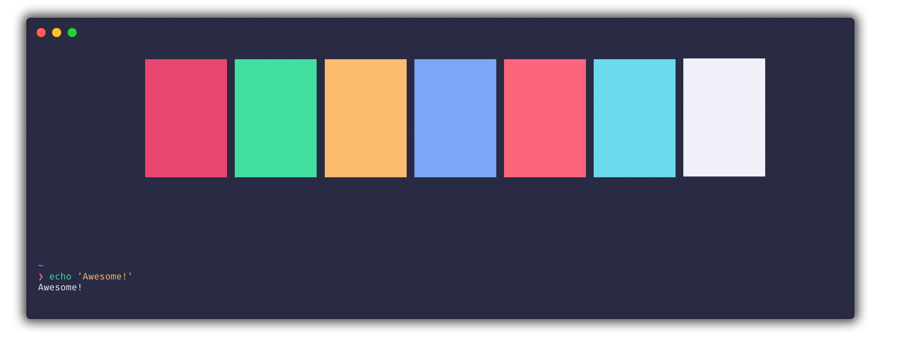

# hyper-gloom

> Elegant [Hyper](https://hyper.is) theme with pastell colors and a fork of [hyper-snazzy](https://github.com/sindresorhus/hyper-snazzy) and inspired by [Gloom](https://github.com/hejrobin/gloom) for Atom.

## Install

Add `hyper-gloom` to the plugins list in your `~/.hyper.js` config file and restart Hyper.

## Tip

To get the exact same look as in the screenshot, you need to use the [Pure](https://github.com/sindresorhus/pure) prompt, Menlo font, and the [zsh-syntax-highlighting](https://github.com/zsh-users/zsh-syntax-highlighting) plugin to have commands highlighted.

## License

MIT © [Sindre Sorhus](https://sindresorhus.com)
